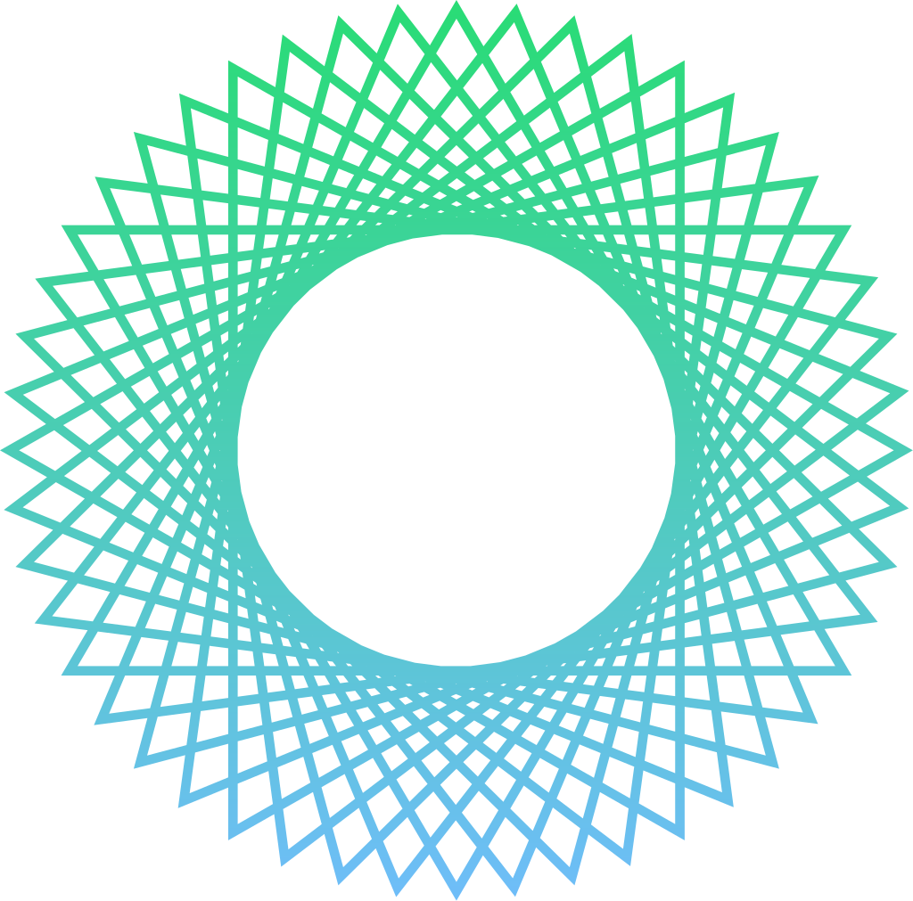

# Visualaise Image Generator



## Overview
Visualaise Image Generator is a cutting-edge MERN stack AI image generator built to provide a seamless and enhanced user experience. It integrates modern web technologies and utilizes a powerful combination of Vite, Tailwind CSS, MongoDB, Cloudinary, and OpenAI DALL-E API to create a potent and responsive tool for generating images dynamically. The project, developed in May 2023 as an individual endeavor, showcases expert craftsmanship in both UX/UI, designed meticulously in Figma, and web development. It is hosted on Render, offering users a smooth and stable platform to access the application.

## Features

* **AI Image Generation**: Leverages OpenAI's DALL-E API for generating images based on user inputs.
* **Cloudinary Integration**: Seamlessly stores and manages images in the Cloudinary cloud-based image management solution.
* **User-Friendly Interface**: A modern, sleek UI crafted in Figma to offer users an intuitive and enjoyable experience.
* **Responsive Design**: Developed using Tailwind CSS to ensure a responsive and consistent design across various devices.

## Getting Started

### Live Demo

You can try out the live demo of the project here: [Visualaise Image Generator](https://imayden.github.io/visualaise/)

### Source Code

The source code for the project is hosted on GitHub and can be found here: [Visualaise GitHub Repository](https://github.com/imayden/project_visualaise_dall-e)

## Technologies Used

* **Frontend**: React (Utilizing the Vite build tool)
* **Backend**: Node.js, Express
* **Database**: MongoDB
* **CSS Framework**: Tailwind CSS
* **Image Management**: Cloudinary
* **AI API**: OpenAI DALL-E API
* **Hosting**: Render
* **UX/UI Design**: Figma

## Setup & Installation

Please follow the below steps to set up and run the project locally:

1. Clone the repository:
    ```
    git clone https://github.com/imayden/project_visualaise_dall-e.git
    ```
2. Navigate to the project directory:
    ```
    cd project_visualaise_dall-e
    ```
3. Install the necessary dependencies:
    ```
    npm install
    ```
4. Set up the environment variables as per the `.env.example` file.
5. Run the project:
    ```
    npm run start
    ```
## Contribution

Contributions, issues, and feature requests are welcome! Feel free to check [issues page](https://github.com/imayden/project_visualaise_dall-e/issues) for open issues or create a new one.

## Contact

- GitHub: [@imayden](https://github.com/imayden)
- Project Link: [Visualaise Image Generator](https://imayden.github.io/visualaise/)


